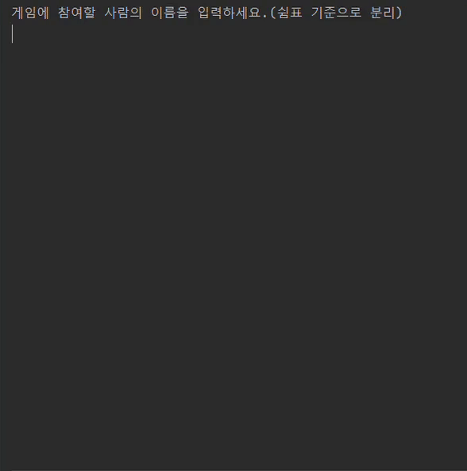

<p align="center">
    
</p>

# 미션 - 블랙잭 게임

###### `우아한테크코스 블랙잭 미션을 진행한 저장소 입니다.`



## 🔍 프로그램 소개

#### 딜러와 블랙잭 게임을 하는 프로그램입니다.

## 🚀 사용자 유의 사항

`사용자로부터 참여자 이름 및 배팅 금액을 입력받습니다.`

```
- 참여자 이름은 5글자 이하로 제한한다.
- 참여자 수는 최대 8명이다.
- 배팅 금액은 100원 ~ 1억까지 가능하며, 배팅 단위는 100원이다.
- 딜러와 게임 참자가는 서로 다른 두 장의 카드를 받는다.
- 딜러는 카드의 합이 17이하일 경우, 카드를 계속 받는다.
- 게임 참여자는 카드를 더 받을 수 있다.
- Hit는 'y' Stay는 'n' 명령어를 사용한다.
- 딜러가 카드를 공개하기 전에 Bust되는 경우, 플레이어는 반드시 패배한다.
- 게임 결과에 따라, 배팅 금액에 따른 돈을 돌려받을 수 있다.
- 블랙잭으로 승리할 경우, 보너스 배당(+0.5배)이 적용된다.
```

